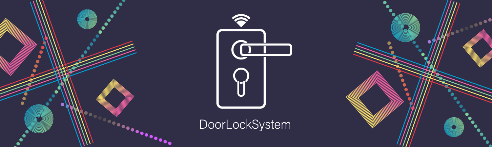
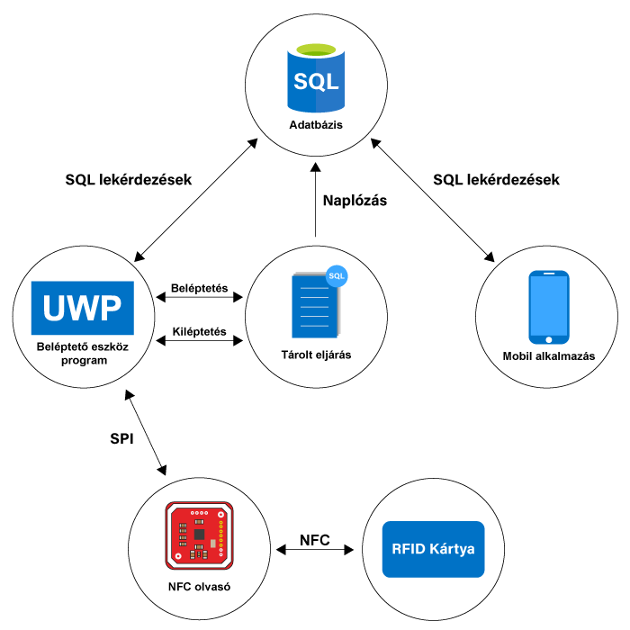

    

    <h1 style="border-bottom: 0">DoorLockSystem</h1>
    <h3>Raspberry Pi 3 program</h3>
    <h4>Szakdolgozat</h4>
     

---

    <h3>A szakdolgozat témája:</h3>

- Egy olyan eszköz tervezése, valamint egy olyan mobilalkalmazás készítése, amely rendszerben mûködve képes kezelni személyek be - és kiléptetését.
- A szakdolgozat a két programon kívül tartalmaz még egy adatbázist is, ami <b>tárolt eljárások</b> segítségével valósítja meg a két program <b>"Backend"</b> részét.

---

    <h3>A projekt leírása:</h3>

- A program C# alapú, UWP-ben lett elkészítve.
- Kompatibilitási okok miatt Raspberry Pi 3-as verziójára lett megírva a program, emiatt esett a választás a Microsoft UWP platformjára.

---

    <h3>Az eszköz programjának grafikai megjelenése:</h3>

- A logót, valamint az alkalmazásban megtalálható összes ikont az <b>Adobe Illustrator</b> nevû program segítségével alkottam meg.
- Az alkalmazás grafikája (logót és design-t egybevéve) nem tartozik egyetlen valós céghez sem, csak a szakdolgozat érdekéken készítettem el.

---

    <h3>A projekthez felhasznált, C# alapú fõbb osztályok, csomagok:</h3>

- Framework: UWP (Universal Windows Platform)
- A Raspberry Pi-hez szükséges csomagok:
    - Iot.Device.Bindings
    - System.Device.Gpio
    - System.IO.Ports

---

     
    <h3>A projekt részletes leírása:</h3>

- A projekt 3 fõ részbõl áll:
    - Adatbázisból, amely az adatokat szolgáltatja az eszköz és a mobilalkalmazás számára.
    - Az általam elkészített eszközbõl, amely az általam kiválasztott alkatrészekbõl elkészítettem.
    - Egy mobil alkalmazásból, amely a eszközön történt változásokat (be és kilépéseket) mutatja a bejelentkezett felhasználónak.
- <b>A további rész az adatbázisról, valamint az eszközrõl való leírást tartalmazza.</b>

     
    
    
A beléptetõ rendszer részei

---

     
    <h3>A program mûködése:</h3>

     
    
    
A beléptetõ rendszer részei

